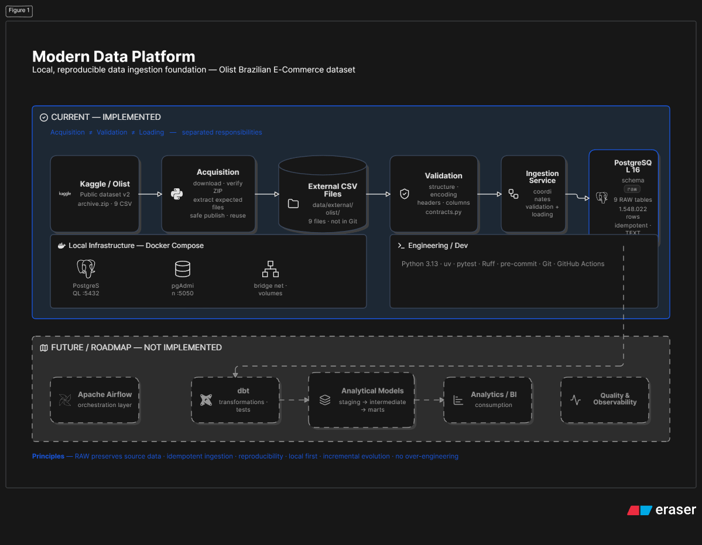

# Modern Data Platform

> Uma plataforma de dados local construída de forma incremental para demonstrar práticas de Data Engineering e Analytics Engineering, com foco em arquitetura, reprodutibilidade, qualidade e manutenibilidade.

Projeto pessoal de portfólio utilizando o **Brazilian E-Commerce Public Dataset by Olist** como primeira fonte de dados.

---

## Overview

O objetivo do projeto é construir uma plataforma de dados de forma incremental, começando pela aquisição, validação e armazenamento dos dados e evoluindo para transformação, modelagem analítica e consumo.

A fundação de ingestão já está implementada e validada com dados reais. A camada RAW preserva os dados de origem no PostgreSQL, enquanto o **dbt foi introduzido como camada de transformação e modelagem**, iniciando pelo staging.

O projeto prioriza **separação de responsabilidades, reprodutibilidade, idempotência e evolução sem over engineering**.

---

## Current Status

### Ingestion Foundation — Completed

A primeira etapa funcional foi implementada e validada com dados reais.

- ✅ Dataset Olist adquirido automaticamente
- ✅ 9 arquivos CSV validados
- ✅ 9 tabelas no schema `raw`
- ✅ **1.548.022 registros carregados**
- ✅ Ingestão idempotente
- ✅ PostgreSQL 16
- ✅ Docker Compose
- ✅ Testes automatizados
- ✅ Ruff e pre-commit
- ✅ GitHub Actions para CI
- ✅ Documentação técnica

As contagens foram verificadas diretamente no PostgreSQL utilizando `COUNT(*)`.

### dbt Staging Foundation — Completed

A primeira camada de transformação foi implementada com dbt.

- ✅ dbt Core com adapter PostgreSQL
- ✅ 9 sources correspondentes às tabelas RAW
- ✅ 9 modelos de staging
- ✅ Staging materializado como views
- ✅ Transformações técnicas e tipagem
- ✅ Testes nativos do dbt
- ✅ Lineage entre RAW e staging
- ✅ `dbt build` validado contra o PostgreSQL local

O dbt não substitui a ingestão Python. A responsabilidade permanece separada:

```text
Python → aquisição, validação e ingestão
dbt    → transformação, testes e modelagem
```

### Next — Analytical Modeling

O próximo estágio será definir um problema analítico e construir uma primeira camada de modelos de negócio/marts para entregar uma solução concreta.

A modelagem ainda não foi implementada.

---

## Current Data Load

| RAW Table | Records |
|---|---:|
| `olist_customers_dataset` | 99,441 |
| `olist_geolocation_dataset` | 1,000,163 |
| `olist_order_items_dataset` | 112,650 |
| `olist_order_payments_dataset` | 103,886 |
| `olist_order_reviews_dataset` | 99,224 |
| `olist_orders_dataset` | 99,441 |
| `olist_products_dataset` | 32,951 |
| `olist_sellers_dataset` | 3,095 |
| `product_category_name_translation` | 71 |
| **Total** | **1,548,022** |

---

## Architecture



### Current Flow

```text
Kaggle / Olist
      ↓
Acquisition
      ↓
Validation
      ↓
PostgreSQL RAW
      ↓
dbt Sources
      ↓
dbt Staging
```

A aquisição, validação, ingestão e transformação são responsabilidades separadas.

A camada RAW preserva os dados de origem. O dbt consome essas tabelas como sources e constrói os modelos de staging.

O fluxo atual termina no staging.

### Next Flow

```text
RAW
 ↓
STAGING
 ↓
Analytical Modeling
 ↓
MART
 ↓
Future Analytics / BI
```

A camada de mart ainda não foi implementada.

**Apache Airflow permanece planejado para uma etapa futura de orquestração.**

---

## Why dbt?

A camada RAW é responsável por preservar os dados de origem e não deve concentrar regras de transformação ou lógica analítica.

À medida que a plataforma evolui, consultas diretamente sobre a RAW podem levar à repetição de transformações, joins e regras entre diferentes análises.

O dbt foi introduzido para criar uma camada de transformação organizada, permitindo:

- modelagem SQL versionada;
- dependências entre modelos;
- testes de dados;
- documentação;
- lineage;
- separação entre dados de origem e modelos analíticos.

Nesta etapa, o dbt foi utilizado para construir a camada de **staging**, mantendo as transformações estritamente técnicas.

A modelagem de negócio será construída em uma etapa posterior.

---

## Architectural Principles

### Separation of Responsibilities

Cada etapa possui uma responsabilidade específica:

```text
Acquisition → Validation → Loading → Transformation
```

A aquisição não acessa o banco de dados, a validação não modifica os dados, a ingestão preserva a origem e o dbt realiza as transformações posteriores.

### RAW Preserves the Source

A camada `raw` representa a origem dos dados.

Os valores são carregados sem limpeza, enriquecimento, métricas ou regras de negócio.

### Staging Prepares the Data

A camada `staging` é construída pelo dbt a partir das sources RAW.

Nesta etapa são realizadas transformações técnicas, como:

- conversão de tipos;
- tratamento técnico de valores vazios;
- padronização de nomes;
- preparação dos dados para as próximas camadas.

Regras de negócio e métricas não fazem parte do staging atual.

### Idempotency

A ingestão foi projetada para permitir novas execuções sem gerar duplicações inesperadas na camada RAW.

### Reproducibility

A fonte possui uma versão configurada e o processo de aquisição pode ser reproduzido localmente.

### Incremental Evolution

Novos componentes são introduzidos conforme a necessidade da plataforma, evitando complexidade prematura.

---

## Data Source

**Brazilian E-Commerce Public Dataset by Olist**

| Item | Value |
|---|---|
| Source | Kaggle |
| Dataset version | `2` |
| Distribution | `archive.zip` |
| Expected files | 9 CSVs |

Os arquivos de dados são armazenados localmente e **não são versionados pelo Git**.

O código, configuração, testes e documentação são versionados no repositório.

---

## Tech Stack

### Current

- Python 3.13
- uv
- Docker
- Docker Compose
- PostgreSQL 16
- pgAdmin 4
- dbt Core
- dbt-postgres 1.11.0
- pytest
- Ruff
- pre-commit
- Git
- GitHub Actions

### Planned

- **Analytical Modeling / Marts** — primeira camada de negócio
- **Apache Airflow** — orquestração
- Data Quality avançada
- Observability
- Camada de consumo analítico

---

## Project Structure

```text
modern-data-platform/
│
├── .github/
│   └── workflows/             # CI
│
├── airflow/                   # Orquestração futura
├── dbt/
│   ├── dbt_project.yml
│   ├── profiles.yml
│   └── models/
│       └── staging/            # Sources e modelos staging
│
├── data/
│   └── external/
│       └── olist/              # Dados externos locais
│
├── docs/
│   ├── assets/
│   │   └── architecture.png    # Diagrama da arquitetura
│   ├── project-overview.md
│   ├── olist-acquisition.md
│   ├── raw-layer.md
│   └── dbt-foundation.md
│
├── scripts/
│   ├── download_olist.py       # Aquisição
│   └── ingest_olist.py         # Ingestão
│
├── src/
│   ├── config.py
│   ├── logging_config.py
│   └── ingestion/
│       ├── acquisition/
│       ├── validation/
│       ├── loading/
│       ├── contracts.py
│       └── service.py
│
├── tests/
│   └── ingestion/
│
├── warehouse/                  # Artefatos analíticos futuros
│
├── ARCHITECTURE.md
├── PROJECT_BRIEF.md
├── ROADMAP.md
├── docker-compose.yml
├── Makefile
├── pyproject.toml
└── README.md
```

---

## Getting Started

### Prerequisites

- Git
- Docker Desktop
- Python 3.13
- uv

### 1. Clone the repository

```bash
git clone git@github.com:glauberavalle/modern-data-platform.git
cd modern-data-platform
```

### 2. Configure environment

Unix/Linux ou Git Bash:

```bash
cp .env.example .env
```

PowerShell:

```powershell
Copy-Item .env.example .env
```

### 3. Start infrastructure

```bash
docker compose up -d
```

Isso inicia:

- PostgreSQL 16
- pgAdmin 4

### 4. Acquire the dataset

```bash
uv run python -m scripts.download_olist
```

### 5. Run RAW ingestion

```bash
uv run python -m scripts.ingest_olist
```

O pipeline irá:

1. adquirir ou reutilizar os arquivos do Olist;
2. validar os nove CSVs esperados;
3. criar o schema `raw`;
4. criar as tabelas RAW;
5. carregar os dados no PostgreSQL.

### 6. Build dbt models

```bash
uv run dbt debug --project-dir dbt --profiles-dir dbt
uv run dbt build --project-dir dbt --profiles-dir dbt
```

O dbt irá:

1. conectar ao PostgreSQL;
2. identificar as sources RAW;
3. construir os modelos de staging;
4. executar os testes declarados.

### Local Services

| Service | Address |
|---|---|
| PostgreSQL | `localhost:5432` |
| pgAdmin | `http://localhost:5050` |

---

## Testing

Os testes Python estão organizados de acordo com as responsabilidades da aplicação:

```text
tests/
└── ingestion/
    ├── acquisition/
    └── validation/
```

A implementação atual possui testes automatizados para aquisição e validação.

Execução:

```bash
uv run pytest
```

Validações adicionais:

```bash
uv run ruff format --check .
uv run ruff check .
pre-commit run --all-files
git diff --check
```

Para validar a camada dbt:

```bash
uv run dbt debug --project-dir dbt --profiles-dir dbt
uv run dbt build --project-dir dbt --profiles-dir dbt
```

---

## Development

Principais comandos:

```bash
make setup

make docker-up
make docker-down
make docker-status
make docker-logs

make download-olist
make ingest-olist

make dbt-debug
make dbt-build

make lint
make format
```

Em ambientes sem `make`, os scripts Python e comandos dbt podem ser executados diretamente com `uv`.

---

## Roadmap

### Completed

- fundação do repositório;
- infraestrutura local;
- PostgreSQL e pgAdmin;
- aquisição automatizada do Olist;
- validação dos arquivos;
- ingestão RAW;
- dbt foundation;
- sources RAW;
- modelos staging;
- testes dbt;
- documentação técnica.

### Next

- definição de um problema analítico;
- modelagem das entidades necessárias;
- criação da primeira camada de marts;
- entrega de uma solução analítica concreta.

### Future

- orquestração com Airflow;
- evolução da qualidade de dados;
- observabilidade;
- novas camadas e domínios analíticos.

O roadmap completo está disponível em [`ROADMAP.md`](ROADMAP.md).

---

## Documentation

| Document | Description |
|---|---|
| [`ARCHITECTURE.md`](ARCHITECTURE.md) | Arquitetura de alto nível |
| [`PROJECT_BRIEF.md`](PROJECT_BRIEF.md) | Contexto, objetivos e escopo |
| [`ROADMAP.md`](ROADMAP.md) | Evolução planejada |
| [`AGENTS.md`](AGENTS.md) | Princípios e convenções de desenvolvimento |
| [`docs/project-overview.md`](docs/project-overview.md) | Visão detalhada do estado atual |
| [`docs/olist-acquisition.md`](docs/olist-acquisition.md) | Processo de aquisição do Olist |
| [`docs/raw-layer.md`](docs/raw-layer.md) | Responsabilidades da camada RAW |
| [`docs/dbt-foundation.md`](docs/dbt-foundation.md) | Fundação e implementação do dbt |
| [`docs/README.md`](docs/README.md) | Índice da documentação técnica |

---

## Project Status

**Current milestone: dbt Staging Foundation**

A fundação de ingestão está concluída e validada com dados reais.

A primeira camada de transformação com dbt também está implementada e validada contra o PostgreSQL local.

O próximo estágio será definir um problema analítico e construir uma primeira camada de modelagem/marts que entregue uma solução concreta.

O projeto continua em desenvolvimento e será evoluído de forma incremental.

---

## License

MIT License.

Consulte [`LICENSE`](LICENSE) para os termos completos.
