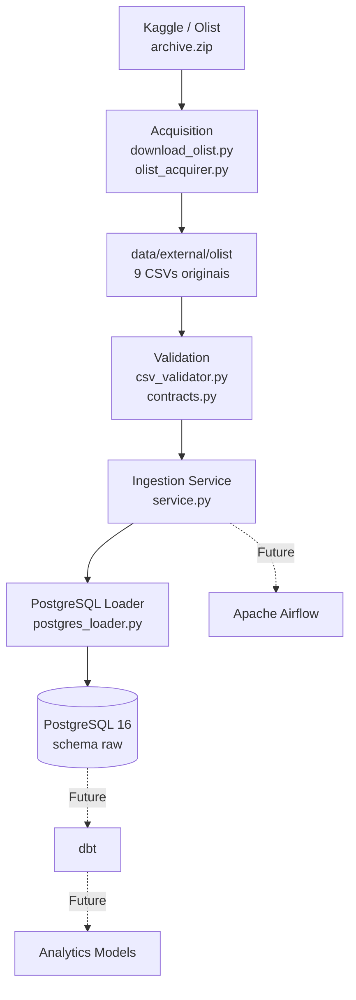

# Modern Data Platform

> Uma plataforma de dados local construída de forma incremental para demonstrar práticas de Data Engineering e Analytics Engineering, com foco em arquitetura, reprodutibilidade, qualidade e manutenibilidade.

Projeto pessoal de portfólio desenvolvido por Sprints, utilizando o **Brazilian E-Commerce Public Dataset by Olist** como primeira fonte de dados.

---

## Overview

O projeto tem como objetivo construir, de forma incremental, uma plataforma moderna de dados capaz de receber diferentes fontes, validar e armazenar dados, transformá-los em camadas analíticas e, posteriormente, orquestrar e monitorar seus pipelines.

A primeira etapa implementa uma pipeline funcional de aquisição, validação e ingestão do Olist em PostgreSQL.

A arquitetura foi projetada para permitir a evolução progressiva da plataforma, evitando complexidade desnecessária antes que ela seja necessária.

---

## Current Status

### Ingestion Foundation — Implemented

A primeira etapa funcional da plataforma está concluída.

Atualmente o projeto possui:

- infraestrutura local com Docker Compose;
- PostgreSQL 16 e pgAdmin 4;
- aquisição automatizada do dataset Olist;
- validação estrutural dos nove CSVs;
- contratos técnicos para os arquivos esperados;
- ingestão idempotente;
- schema `raw` no PostgreSQL;
- nove tabelas RAW, uma por arquivo de origem;
- dados preservados como `TEXT`, sem transformações analíticas;
- **1.548.022 registros carregados**;
- testes automatizados com pytest;
- lint e formatação com Ruff;
- configuração por variáveis de ambiente;
- GitHub Actions;
- documentação técnica e operacional.

### Current Data Load

A execução real da ingestão resultou nas seguintes contagens:

| RAW Table | Records |
|---|---:|
| `olist_customers_dataset` | 99,441 |
| `olist_geolocation_dataset` | 1,000,163 |
| `olist_order_items_dataset` | 112,650 |
| `olist_order_payments_dataset` | 103,886 |
| `olist_order_reviews_dataset` | 99,224 |
| `olist_orders_dataset` | 99,441 |
| `olist_products_dataset` | 32,951 |
| `olist_sellers_dataset` | 3,095 |
| `product_category_name_translation` | 71 |
| **Total** | **1,548,022** |

As contagens foram verificadas diretamente no PostgreSQL utilizando `COUNT(*)` nas tabelas do schema `raw`.

---

## Architecture



A arquitetura separa aquisição, validação, coordenação do fluxo e carregamento.

O fluxo atual termina na camada `raw`. **dbt** e **Apache Airflow** fazem parte da evolução planejada da plataforma e ainda não estão implementados.

---

## Data Flow

```text
Kaggle / Olist
      ↓
Acquisition
      ↓
External Files
      ↓
Validation
      ↓
Ingestion Service
      ↓
PostgreSQL RAW
```

Os CSVs originais são armazenados localmente em:

```text
data/external/olist/
```

Eles são validados antes da carga e carregados no PostgreSQL preservando os valores da fonte.

---

## Data Source

| Item | Value |
|---|---|
| Dataset | Brazilian E-Commerce Public Dataset by Olist |
| Source | [Kaggle](https://www.kaggle.com/datasets/olistbr/brazilian-ecommerce) |
| Configured version | `2` |
| Distribution | `archive.zip` |
| Expected files | 9 CSVs |

A aquisição utiliza uma versão específica da fonte para aumentar a reprodutibilidade do pipeline.

Quando os arquivos já estão disponíveis localmente e válidos, a aquisição pode reutilizá-los em vez de realizar um novo download.

Os dados externos não são versionados pelo Git. **O código, as configurações, os testes e a documentação são versionados no repositório.**

---

## RAW Layer

A camada `raw` representa a primeira camada de armazenamento da plataforma.

Seu objetivo é preservar os dados provenientes da fonte antes das transformações analíticas.

### RAW responsibilities

- preservar os valores de origem;
- manter a estrutura dos arquivos fonte;
- representar cada arquivo como uma tabela RAW;
- disponibilizar os dados para as próximas camadas.

### RAW does not

- aplicar regras de negócio;
- calcular métricas ou KPIs;
- realizar deduplicação;
- criar relacionamentos analíticos;
- enriquecer os dados;
- realizar transformações analíticas.

Essas responsabilidades serão tratadas nas camadas posteriores da plataforma.

---

## Tech Stack

### Current

- Python 3.13
- uv
- Docker
- Docker Compose
- PostgreSQL 16
- pgAdmin 4
- pytest
- Ruff
- pre-commit
- Git
- GitHub Actions

### Planned

- dbt para transformação e modelagem analítica;
- Apache Airflow para orquestração;
- evolução das camadas analíticas;
- data quality;
- observability;
- evolução de CI/CD.

---

## Project Structure

```text
modern-data-platform/
│
├── .github/
│   └── workflows/             # CI/CD
│
├── airflow/                   # Orquestração futura
│
├── data/
│   └── external/
│       └── olist/             # Dados externos locais, não versionados
│
├── dbt/                       # Transformações futuras
│
├── docs/                      # Documentação técnica
│
├── scripts/
│   ├── download_olist.py      # Aquisição do dataset
│   └── ingest_olist.py        # Execução da ingestão
│
├── src/
│   ├── config.py              # Configuração
│   ├── logging_config.py      # Configuração de logs
│   └── ingestion/
│       ├── acquisition/       # Aquisição
│       ├── validation/        # Validação
│       ├── loading/           # Carga
│       ├── contracts.py       # Contratos
│       └── service.py         # Coordenação da ingestão
│
├── tests/
│   └── ingestion/             # Testes automatizados
│
├── warehouse/                 # Artefatos analíticos futuros
│
├── ARCHITECTURE.md
├── AGENTS.md
├── PROJECT_BRIEF.md
├── ROADMAP.md
├── docker-compose.yml
├── Makefile
├── pyproject.toml
└── README.md
```

---

## Getting Started

### Prerequisites

- Git
- Docker Desktop
- Python 3.13
- uv

### 1. Clone

```bash
git clone https://github.com/glauberavalle/modern-data-platform.git
cd modern-data-platform
```

### 2. Configure environment

Unix/Linux ou Git Bash:

```bash
cp .env.example .env
```

PowerShell:

```powershell
Copy-Item .env.example .env
```

### 3. Start infrastructure

```bash
docker compose up -d
```

Isso inicia:

- PostgreSQL 16;
- pgAdmin 4.

### 4. Acquire Olist dataset

```bash
uv run python -m scripts.download_olist
```

### 5. Run RAW ingestion

```bash
uv run python -m scripts.ingest_olist
```

O pipeline irá:

1. adquirir ou reutilizar os arquivos do Olist;
2. validar os nove CSVs esperados;
3. criar o schema `raw`, se necessário;
4. criar as tabelas RAW;
5. carregar os dados no PostgreSQL.

### Local Services

| Service | Address |
|---|---|
| PostgreSQL | `localhost:5432` |
| pgAdmin | `http://localhost:5050` |

---

## Development

Principais comandos disponíveis:

```bash
make setup
make docker-up
make docker-down
make docker-status
make docker-logs
make download-olist
make ingest-olist
make lint
make format
```

Em ambientes sem `make`, os scripts Python podem ser executados diretamente com `uv`.

---

## Testing

Os testes estão organizados de acordo com as responsabilidades da aplicação:

```text
tests/
└── ingestion/
    ├── acquisition/
    ├── validation/
    └── loading/
```

A implementação atual possui testes automatizados para os componentes de aquisição, validação e ingestão.

---

## Engineering Principles

O projeto segue alguns princípios técnicos:

- separação clara de responsabilidades;
- evolução incremental;
- reprodutibilidade;
- idempotência;
- preservação dos dados de origem;
- testes automatizados;
- documentação como parte da entrega;
- evitar over engineering;
- decisões arquiteturais orientadas pela necessidade real.

---

## Roadmap

A plataforma está sendo construída incrementalmente.

### Completed

- fundação do repositório;
- infraestrutura local;
- PostgreSQL e pgAdmin;
- aquisição automatizada do Olist;
- validação dos arquivos;
- ingestão RAW;
- testes iniciais;
- documentação técnica.

### Next

- transformação e modelagem com dbt;
- criação das camadas analíticas;
- orquestração com Airflow;
- evolução dos testes de qualidade;
- observabilidade;
- camada analítica para consumo dos dados.

O roadmap completo está disponível em [`ROADMAP.md`](ROADMAP.md).

---

## Documentation

- [`ARCHITECTURE.md`](ARCHITECTURE.md) — arquitetura de alto nível;
- [`PROJECT_BRIEF.md`](PROJECT_BRIEF.md) — contexto e escopo;
- [`ROADMAP.md`](ROADMAP.md) — evolução planejada;
- [`AGENTS.md`](AGENTS.md) — princípios e convenções de desenvolvimento;
- [`docs/`](docs/) — documentação técnica detalhada.

---

## Project Status

**Current milestone: Ingestion Foundation**

A primeira pipeline funcional está concluída e validada com dados reais.

O projeto continua em desenvolvimento, com a próxima etapa direcionada à transformação e modelagem analítica.

---

## License

Projeto pessoal de portfólio.

Consulte [`LICENSE`](LICENSE) para os termos aplicáveis.

Esse é o que eu colocaria agora no README.md.

Uma única observação: mantive os números 1.548.022 porque acabamos de confirmá-los diretamente no PostgreSQL, não porque o Codex informou.

Depois que você colar, não precisa commitar ainda. O próximo passo é me mandar o ROADMAP.md; aí alinhamos o README com ele antes de fechar os demais arquivos.

Roadmap

Este roadmap descreve as sprints planejadas para a evolução inicial do projeto, sempre com foco em entregar valor real, manter simplicidade e evitar over engineering.

Princípios de priorização
cada Sprint deve entregar algo útil e compreensível;
mudanças arquiteturais devem ser avaliadas antes de serem implementadas;
melhorias importantes podem ser adicionadas ao roadmap para análise posterior;
a estrutura deve permitir crescimento sem grandes refatorações.
Sprint 1 — Fundação do repositório
criar estrutura inicial do projeto;
documentar arquitetura e diretrizes;
configurar ferramentas de qualidade;
preparar ambientes com Docker Compose;
definir padrões de contribuição.
Sprint 2 — Infraestrutura base
definir variáveis de ambiente;
preparar containers e serviços iniciais;
estruturar diretórios para pipelines e modelos;
documentar fluxos de desenvolvimento.
Sprint 3 — Ingestão e transformação
definir fontes de dados iniciais;
estruturar pipelines de ingestão;
preparar camada de staging e warehouse;
organizar modelos no dbt.
Sprint 4 — Orquestração e observabilidade
integrar Apache Airflow;
criar organização inicial de DAGs;
preparar logs, monitoramento e documentação operacional.
Sprint 5 — Qualidade e CI/CD
integrar GitHub Actions;
aplicar verificações automáticas;
preparar evolução da governança do projeto.
Fase posterior

A partir desta base, o projeto poderá evoluir para cenários mais complexos de dados, governança e automação.

road map

Sim — e aqui encontramos uma inconsistência importante antes de fechar o README.

O ROADMAP.md atual foi escrito antes de implementarmos a ingestão do Olist. Por isso, ele está atrasado em relação ao projeto real.

Hoje temos:

Sprint 1 — Fundação              ✅
Sprint 2 — Infraestrutura base   ✅
Sprint 3 — Ingestão RAW          ✅

Mas o roadmap atual coloca ingestão + transformação juntos na Sprint 3:

"Sprint 3 — Ingestão e transformação"

Isso não representa mais nossa arquitetura. Nós deliberadamente separamos:

Aquisição
   ↓
Validação
   ↓
RAW
   ↓
dbt
   ↓
Staging / Intermediate / Marts

Então eu não usaria o README que te passei exatamente como está até corrigirmos o Roadmap.

Eu substituiria o ROADMAP.md por este
# Roadmap

Este roadmap descreve a evolução incremental da Modern Data Platform.

Cada Sprint deve entregar uma capacidade funcional clara, mantendo simplicidade, reprodutibilidade e qualidade técnica. Novas tecnologias e decisões arquiteturais devem ser introduzidas conforme exista uma necessidade concreta.

---

## Princípios de priorização

- cada Sprint deve entregar valor real e verificável;
- mudanças arquiteturais devem ser avaliadas antes de serem implementadas;
- a complexidade deve acompanhar a necessidade do projeto;
- cada camada deve possuir uma responsabilidade clara;
- decisões técnicas devem ser documentadas;
- a plataforma deve evoluir de forma incremental;
- evitar over engineering.

---

# Sprint 1 — Fundação do repositório

**Status: Concluída**

Objetivo: estabelecer a estrutura inicial e as convenções do projeto.

### Entregas

- estrutura inicial do repositório;
- documentação inicial de arquitetura;
- `AGENTS.md`;
- `PROJECT_BRIEF.md`;
- `ARCHITECTURE.md`;
- `ROADMAP.md`;
- configuração inicial do Python;
- configuração de qualidade de código;
- estrutura inicial para testes;
- configuração inicial de CI;
- definição das convenções de desenvolvimento.

---

# Sprint 2 — Infraestrutura local

**Status: Concluída**

Objetivo: estabelecer uma infraestrutura local reproduzível para desenvolvimento.

### Entregas

- Docker Compose;
- PostgreSQL 16;
- pgAdmin 4;
- volumes persistentes;
- rede Docker dedicada;
- healthcheck do PostgreSQL;
- configuração por variáveis de ambiente;
- `.env.example`;
- comandos auxiliares de desenvolvimento;
- documentação de inicialização da infraestrutura.

---

# Sprint 3 — Ingestion Foundation

**Status: Concluída**

Objetivo: implementar a primeira pipeline funcional de aquisição, validação e ingestão de dados.

### Fonte

**Brazilian E-Commerce Public Dataset by Olist**

Versão configurada:

```text
2
Entregas
aquisição automatizada do dataset Olist;
download e extração do arquivo ZIP;
armazenamento local dos arquivos externos;
validação estrutural dos nove CSVs;
contratos técnicos dos arquivos;
separação entre aquisição, validação e carga;
serviço de ingestão;
carga idempotente;
schema raw no PostgreSQL;
nove tabelas RAW;
preservação dos valores de origem;
testes automatizados;
logs da ingestão;
documentação da aquisição e da camada RAW.
Resultado validado

A ingestão foi executada com dados reais e resultou em:

9 tabelas RAW

1.548.022 registros

distribuídos entre os arquivos do dataset Olist.

Sprint 4 — Transformation & Analytics Engineering

Status: Próxima etapa

Objetivo: transformar os dados RAW em estruturas analíticas utilizando dbt.

Objetivos
configurar o projeto dbt;
conectar o dbt ao PostgreSQL;
estruturar a camada de staging;
definir modelos de transformação;
aplicar tipagem adequada aos dados;
documentar os modelos;
criar testes de dados;
estruturar camadas intermediárias quando necessário;
preparar os primeiros modelos analíticos.
Arquitetura esperada
RAW
 ↓
STAGING
 ↓
INTERMEDIATE
 ↓
MARTS

A camada RAW continuará preservando os dados de origem.

As transformações e regras de negócio serão introduzidas a partir desta etapa.

Sprint 5 — Orchestration

Status: Planejada

Objetivo: introduzir orquestração dos pipelines.

Objetivos
integrar Apache Airflow;
estruturar DAGs;
definir dependências entre etapas;
executar aquisição e ingestão de forma orquestrada;
preparar execução dos modelos dbt;
documentar operações do pipeline.

Arquitetura esperada:

Airflow
   │
   ├── Acquisition
   │
   ├── Validation
   │
   ├── RAW Ingestion
   │
   └── dbt

A introdução do Airflow será feita somente quando a complexidade do pipeline justificar a necessidade de um orquestrador dedicado.

Sprint 6 — Data Quality & CI/CD

Status: Planejada

Objetivo: aumentar a confiabilidade e a automação do projeto.

Objetivos
ampliar testes de qualidade dos dados;
integrar validações ao CI;
executar testes automaticamente;
validar código e modelos;
evoluir GitHub Actions;
estabelecer verificações de qualidade antes de alterações serem integradas;
documentar os processos de qualidade.
Sprint 7 — Observability & Analytics

Status: Planejada

Objetivo: evoluir a plataforma para maior visibilidade operacional e consumo analítico.

Possíveis evoluções
monitoramento dos pipelines;
métricas de execução;
identificação de falhas;
documentação operacional;
evolução dos modelos analíticos;
camada de consumo para SQL e BI;
indicadores derivados do dataset Olist.

A implementação desta Sprint dependerá das necessidades observadas nas etapas anteriores.

Fase posterior

Após a consolidação das etapas anteriores, a plataforma poderá evoluir para cenários mais complexos envolvendo:

novas fontes de dados;
múltiplos pipelines;
governança;
data lineage;
observabilidade avançada;
ambientes separados;
automação de deploy;
evolução da arquitetura de armazenamento;
novos casos de uso analítico.

Essas evoluções serão avaliadas conforme o projeto crescer e não fazem parte do escopo atual.


## Por que prefiro essa versão?

Porque agora o roadmap conta **a história que realmente aconteceu**:

```text
                 MODERN DATA PLATFORM

Sprint 1
Fundação
   ↓
Sprint 2
Infraestrutura
   ↓
Sprint 3
Olist → RAW                 ← ESTAMOS AQUI
   ↓
Sprint 4
RAW → dbt → Marts
   ↓
Sprint 5
Airflow
   ↓
Sprint 6
Quality + CI/CD
   ↓
Sprint 7
Observability + Analytics
